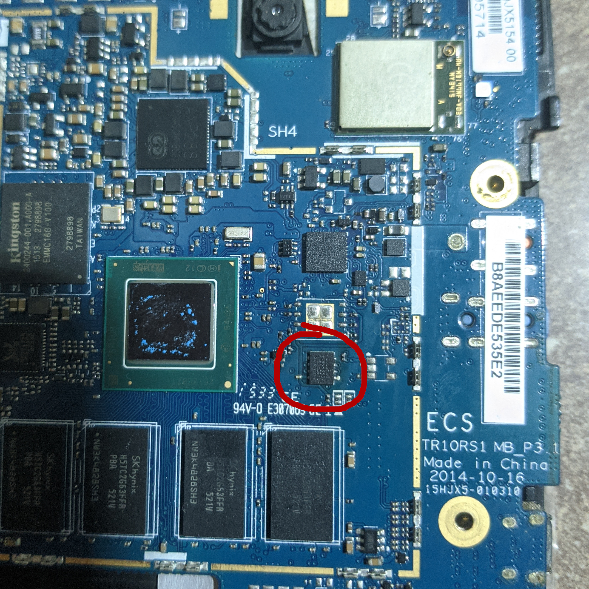
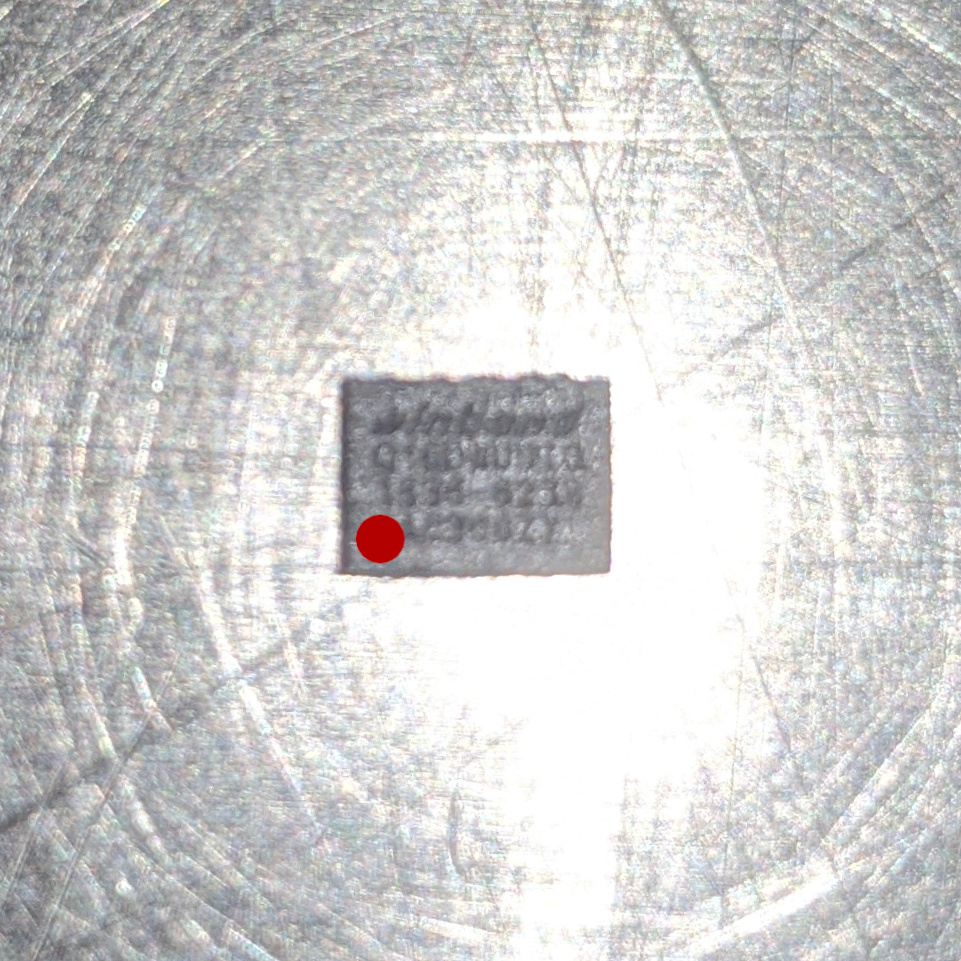
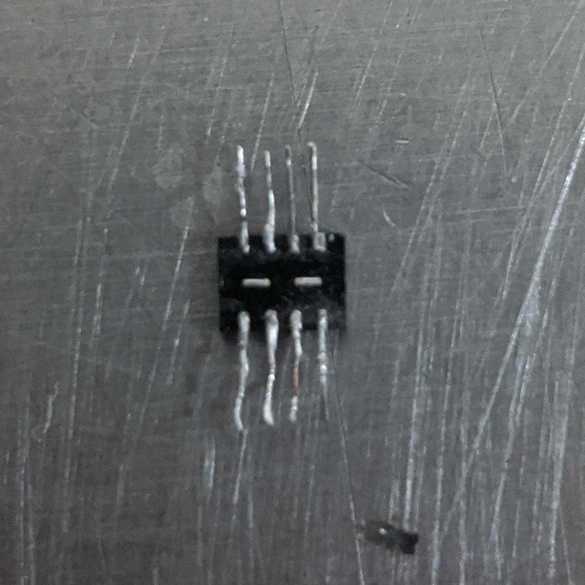
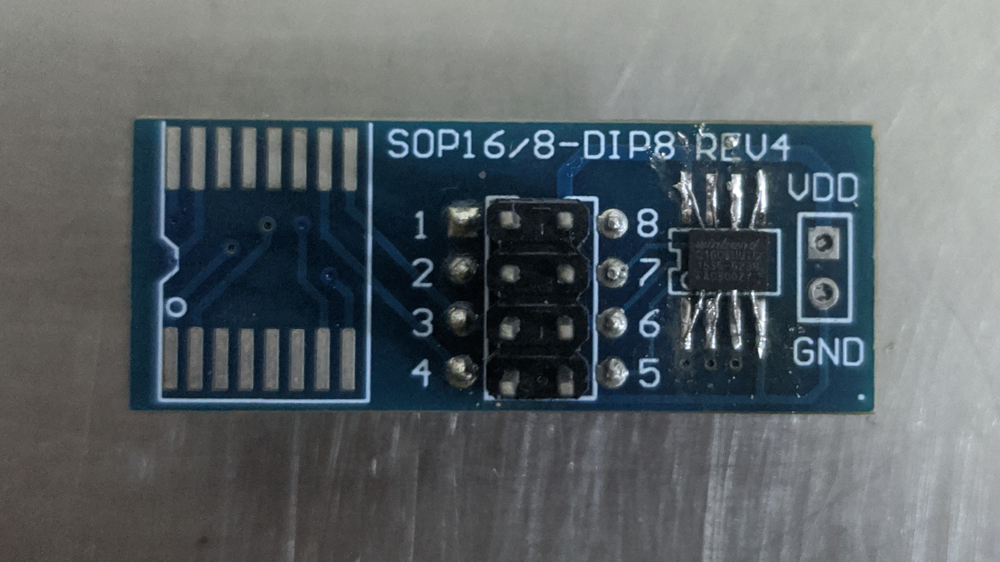

# TR10RS1_BIOS

Dejo la BIOS extraída de la tablet canaima **TR10RS1** **original** y una **modificada** con el microcódigo del procesador actualizado, además de información sobre su instalación

## Información del fabricante

**Nota: El modelo no se ve en el microchip sino que el software del programador CH341A lo reconoce como el siguiente:**

- Fabricante: **Winbond**
- Modelo: **W25Q16**
- Tamaño: **2M**

## Extracción y flasheo

- ### Por software

  Esta **BIOS** está basada solamente en **EFIx64** (**UEFI**) 			desarrollada por **PHOENIX** por lo que usar las típicas herramientas para el sistema **DOS** no es posible, y desconozco un método para hacerlo desde el **EFI SHELL**, la solución sería hacerlo desde alguno de los siguientes sistemas operativos:

  - **Windows**
    - [**Universal BIOS Backup Toolkit 2.0**](https://github.com/zabiyakod/Bios-Reader.git) (Recomendado)
    - [**Winflash/Winphlash**](https://www.wimsbios.com/phoenixflasher.jsp#gsc.tab=0) (No probado pero en teoría alguno de ellos debería de funcionar)

  - **GNU Linux**:
    - [**BIOSUtilities**](https://github.com/platomav/BIOSUtilities)

- ### Por hardware
  
	**Nota: Este es quizás el método más complicado de hacer, pero el más fiable si se hace bien**
	
	Utilizando un programador **CH341A** con un adaptador a **1.8v** y retirando la BIOS de la placa madre:
	
	
	
	Este pequeño microchip no tiene el típico indicador visual sobre cual es su pin Nº1 sin embargo sigue el mismo orden que el resto de las BIOS de 8 pines y con el texto en la orientación correcta
	
	
	
	Si no tiene el conector (como en mi caso) toca ingeniárselas soldando algunos pines para alargar las conexiones
	
	
	
	Y soldarlo al conector sin aplicar demasiado calor para que no se suelte la soldadura de los pines de la BIOS
	
	

	

